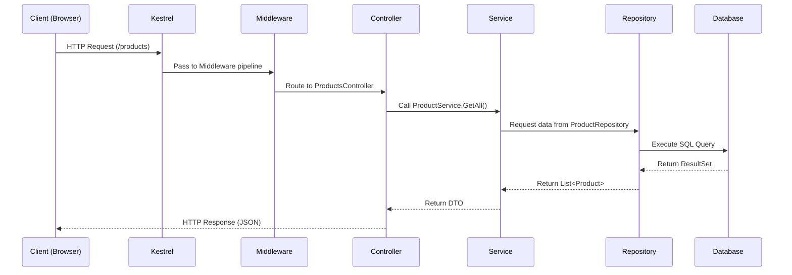

# ASP.NET Core MVC Request Pipeline (v8)

## Story Setup

Think of building a web application like running a relay race. Each runner (layer) has a responsibility and passes the baton (HTTP request) forward until the finish line (response). ASP.NET Core MVC structures this race clearly using Middleware, Controllers, Services, and Repositories.


## Big Picture (Architecture)

```
Client (Browser / Angular)
   ↓
Kestrel Web Server (.NET 8)
   ↓
Middleware (Routing, Auth, Logging, Compression)
   ↓
MVC Controller (Entry point of logic)
   ↓
Service Layer (Business Rules)
   ↓
Repository (Data Access using EF Core / Dapper)
   ↓
Database (SQL Server / MySQL)
```

## Sequence Flow (Mermaid Diagram)




## Minimal Program.cs (ASP.NET Core 8)

```csharp
var builder = WebApplication.CreateBuilder(args);

// Add services
builder.Services.AddControllers();
builder.Services.AddScoped<IProductService, ProductService>();
builder.Services.AddScoped<IProductRepository, ProductRepository>();
builder.Services.AddEndpointsApiExplorer();
builder.Services.AddSwaggerGen();

var app = builder.Build();

// Middleware pipeline
if (app.Environment.IsDevelopment())
{
    app.UseSwagger();
    app.UseSwaggerUI();
}

app.UseHttpsRedirection();
app.UseAuthorization();
app.MapControllers();

app.Run();
```

## Controller Example

```csharp
[ApiController]
[Route("api/[controller]")]
public class ProductsController : ControllerBase
{
    private readonly IProductService _service;
    public ProductsController(IProductService service)
    {
        _service = service;
    }

    [HttpGet]
    public async Task<IActionResult> GetAll()
    {
        var products = await _service.GetAllProductsAsync();
        return Ok(products);
    }
}
```

## Service Example

```csharp
public interface IProductService
{
    Task<IEnumerable<Product>> GetAllProductsAsync();
}

public class ProductService : IProductService
{
    private readonly IProductRepository _repository;
    public ProductService(IProductRepository repository)
    {
        _repository = repository;
    }

    public async Task<IEnumerable<Product>> GetAllProductsAsync()
    {
        return await _repository.GetProductsAsync();
    }
}
```

## Repository Example (Dapper + MySQL)

```csharp
public interface IProductRepository
{
    Task<IEnumerable<Product>> GetProductsAsync();
}

public class ProductRepository : IProductRepository
{
    private readonly string _connectionString;
    public ProductRepository(IConfiguration config)
    {
        _connectionString = config.GetConnectionString("DefaultConnection");
    }

    public async Task<IEnumerable<Product>> GetProductsAsync()
    {
        using var connection = new MySqlConnection(_connectionString);
        return await connection.QueryAsync<Product>("SELECT * FROM Products");
    }
}
```

## appsettings.json Snippet

```json
{
  "ConnectionStrings": {
    "DefaultConnection": "Server=localhost;Database=ShopDB;User=root;Password=admin;"
  },
  "Logging": {
    "LogLevel": {
      "Default": "Information",
      "Microsoft": "Warning"
    }
  },
  "AllowedHosts": "*"
}
```

## Testing Plan

* Run `dotnet new webapi -n ShopApi -f net8.0`
* Add Controller, Service, Repository
* Configure Swagger (`/swagger`) to test endpoints
* Verify DB connection with test data
* Call from Angular front-end using `HttpClient`

## CLI Commands Recap

```bash
# Create solution
 dotnet new sln -n ShopSolution

# Create Web API project targeting .NET 8
 dotnet new webapi -n ShopApi -f net8.0

# Add project to solution
 dotnet sln ShopSolution.sln add ShopApi/ShopApi.csproj

# Run project
 dotnet run --project ShopApi
```

